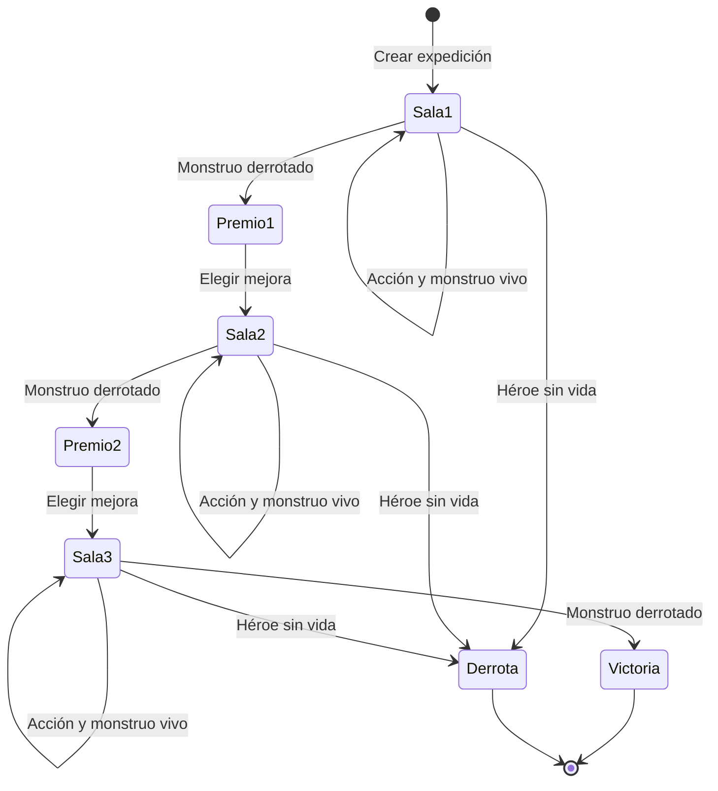

# Etapa 2 Guía de expedición PvE persistente en Midnight

**Continuación de:** [Etapa 1 Arena PvE](etapa_1_arena_pve.md) y su [implementación](etapa-1-arena-pve/). **Meta:** transformar un combate aislado en una expedición de tres salas que conserva recursos, ofrece mejoras y puede reanudarse. Material docente, revisado el 28 de septiembre de 2026.

## La consigna

Construí una expedición de tres salas, jugable por una sola persona, sobre el contrato de la Etapa 1. El jugador conserva vida y energía de una sala a otra. Después de superar las salas 1 y 2 elige una recompensa entre recuperar energía o curarse. Al volver a abrir el cliente, debe continuar desde el estado confirmado de la partida. La partida termina al superar la sala 3, perder toda la vida o abandonar explícitamente.

**Pregunta que guía la clase:** ¿qué datos pueden existir solo en la memoria del cliente y cuáles deben persistir para que nadie invente una recompensa, salte una sala o resuelva dos veces el mismo turno?

### Flujo de la expedición



La selección de recompensa es una **transición separada**: no se puede combatir en la siguiente sala antes de escoger, ni pedirla dos veces. Una transacción pendiente no equivale a una sala terminada.

## Reglas jugables propuestas

| Elemento | Regla de esta versión |
| --- | --- |
| Héroe | 10 PV iniciales, máximo 12; 3 de energía inicial y máxima. |
| Salas | Monstruos de 7, 4 y 6 PV, en ese orden. Cada sala empieza con su vida completa. |
| Golpe | 4 de daño, 0 energía. |
| Bloqueo | 1 de daño, 0 energía; si el monstruo sobrevive, su contraataque causa 1. |
| Hechizo | 7 de daño, cuesta 2 de energía y causa 2 de retroceso al héroe. |
| Contraataque | El monstruo causa 3 si sobrevive al ataque, salvo cuando el jugador bloquea. |
| Recompensa después de salas 1 y 2 | `RECUPERAR`: +2 de energía hasta el máximo de 3. `CURAR`: +2 PV hasta el máximo de 12. |
| Fin | Victoria al vencer sala 3; derrota con 0 PV; la vida y energía se arrastran entre salas. |

El ataque del jugador se aplica primero. El retroceso del hechizo ocurre aunque el monstruo muera. Si ambos pudieran quedar en 0 en futuras variantes, fijá un orden explícito de resolución y probalo. Los valores pequeños permiten contar a mano, pero ya exigen gestionar energía, límites y varios estados.

**Recorrido de referencia:** hechizo en sala 1 → héroe 8 PV, energía 1; recuperar → energía 3; golpe en sala 2 → héroe 8 PV; curar → héroe 10 PV; hechizo en sala 3 → héroe 8 PV, energía 1, victoria. Un camino diferente puede ser válido. El contrato no debe forzar este recorrido.

## Mapa de aprendizaje

Al terminar la etapa tenés que dominar:

1. **Estado persistente y máquina de estados:** separar `en combate`, `elegir recompensa`, `ganada` y `perdida`; hacer explícitas las transiciones permitidas.
2. **Circuitos con estado:** actualizar vida, energía, sala y turno con una única fuente de verdad. Leer el estado producido por la llamada anterior al construir la siguiente.
3. **Aritmética acotada:** comprobar energía suficiente *antes* de descontarla, y saturar daño y curación para evitar underflow u overflow.
4. **Identidad y acceso:** vincular una instancia a su dueño mediante una identidad derivada de un secreto y comprobarla en cada acción. El valor de `ownPublicKey()` por sí solo no autentica al jugador.
5. **Witnesses y persistencia privada:** conservar el secreto de dueño y, si se desea, la elección local de acción sin escribirlos en el ledger. Comprender respaldo y recuperación del estado privado.
6. **Repetición y concurrencia:** una acción solo vale desde la fase y turno esperados; un cliente desactualizado debe refrescar y reintentar, nunca sobrescribir el estado confirmado.
7. **Pruebas de secuencias:** verificar expediciones completas, rutas alternativas y ataques que cruzan varias transiciones.

## Parte teórica

### 1 Una partida es una máquina de estados

En la Etapa 1 había dos estados: abierto y resuelto. Ahora los estados y permisos importan más que la fórmula de daño. `actuar` solo es válido durante combate; `elegirRecompensa` solo después de superar las salas 1 o 2; `continuar` ocurre como consecuencia de esa elección. Una victoria o derrota no admiten más acciones. No confíes en deshabilitar botones: el circuito debe rechazar llamadas inválidas.

**Ejercicio mental:** escribí todos los pares `(fase, operación)` y marcá cuáles se permiten. ¿Qué sucede si llegan dos solicitudes de recompensa casi al mismo tiempo? La segunda debe evaluar el estado actualizado y fallar. [Compact desde JavaScript](https://docs.midnight.network/guides/compact-javascript-runtime) explica cómo invocar circuitos y leer el ledger resultante; las pruebas locales no sustituyen la confirmación de red.

### 2 Ledger público, estado privado y secretos inferibles

La sala actual, los PV, la energía, la fase y la mejora escogida son públicos en este diseño: cualquier cliente puede reconstruir una expedición. El secreto de acceso vive en estado privado y el contrato conserva solo una identidad derivada. La acción de combate puede llegar mediante witness, pero los cambios de PV y energía permiten inferirla con frecuencia. **La Etapa 2 no promete ocultar la secuencia táctica después de resolver.** Su objetivo es dominar persistencia y transiciones; compromisos, información secreta del enemigo y revelación selectiva vendrán después.

Un witness se ejecuta fuera del circuito y el usuario puede sustituir su implementación. Validá su resultado en Compact. `disclose()` declara el paso de un valor derivado de datos privados a una posición pública; no convierte mágicamente todo el estado local en público. [Seguridad de Compact](https://docs.midnight.network/compact/smart-contract-security) · [Visibilidad onchain](https://docs.midnight.network/guides/security-best-practices).

### 3 Identidad sin confiar en el frontend

La arena de la Etapa 1 permitía que cualquiera resolviese el contrato abierto. Ahora añadimos una credencial del propietario: generá un secreto aleatorio criptográficamente seguro, derivá una identidad con hash y un separador de dominio específico del juego, fijala al crear la expedición y exigí la prueba del mismo secreto en `actuar` y `elegirRecompensa`. Una cadena o dirección enviada por el cliente no prueba propiedad. La documentación oficial advierte que `ownPublicKey()` es un witness elegido por el probador y no basta para autenticar. [Guía de autenticación y pruebas adversarias](https://docs.midnight.network/guides/security-best-practices).

**Decisión de diseño:** una instancia de contrato representa una expedición de un dueño. Evitamos todavía mapas de cientos de jugadores o contadores globales. Si el secreto se pierde, se pierde la capacidad de continuar; documentá un método de respaldo antes de compartir la DApp con otras personas. Midnight.js ofrece proveedores para estado privado cifrado, pero el respaldo y la recuperación siguen siendo decisiones de la aplicación. [API de Midnight.js](https://docs.midnight.network/api-reference/midnight-js).

### 4 Control de costes y confirmación

Un turno debería hacer una sola transición atómica. La interfaz puede previsualizar daño con la función pura de TypeScript, pero el resultado autoritativo viene del circuito y, en red, de la transacción confirmada. Cronometrá compilación, ejecución local, generación de prueba y confirmación por separado. Si una acción onchain tarda demasiado para una animación fluida, la presentación se desacopla del asentamiento sin fingir que la partida se confirmó. [Pruebas locales y proof server](https://docs.midnight.network/guides/local-proving) · [Despliegue y operación](https://docs.midnight.network/guides/deploy-and-operate).

## Parte práctica como laboratorio guiado

### Bloque A Especificación y modelo

1. Partí de `etapa-1-arena-pve/` y copiá **solo el código necesario** a una carpeta nueva `etapa-2-expedicion-pve/`. Conservá intacta la solución anterior como punto de comparación.
2. Dibujá la máquina de estados y escribí una tabla de transiciones. Definí una estructura conceptual como `roomIndex`, `roomMonsterHp`, `heroHp`, `energy`, `phase`, `outcome`, `turn`, `ownerCommitment`.
3. Decidí si `turn` aumenta al atacar, al elegir recompensa o en ambos casos. Documentalo y usalo para pruebas de repetición. No dependas solo de un número de turno provisto por el cliente: contrastalo con el estado actual.
4. Escribí una función pura de referencia `step(state, operation)` en TypeScript y enumerá los errores esperados. Esta función ayuda a explorar reglas, pero no reemplaza las validaciones de Compact.

**Pausa docente:** preguntate qué estado exacto existe tras derrotar a la sala 2 y antes de elegir premio. Si tu modelo dice simultáneamente “combate” y “premio”, faltan fases.

### Bloque B Contrato Compact

1. Extendé el ledger con fase, sala, energía y turno. Definí constantes o reglas que determinen la vida inicial de cada monstruo. La vida de una sala nueva debe provenir de reglas del contrato, no de un parámetro libre del cliente.
2. Agregá autorización de propietario. Seguí la guía oficial para derivar la identidad y validar el secreto dentro del circuito. Pensá cómo inicializar la propiedad de modo que no exista una ventana donde otro usuario pueda reclamarla.
3. Implementá `actuar` con validaciones de fase, acción y energía. Calculá los nuevos valores como variables acotadas y escribilos en el ledger con divulgaciones deliberadas. En la Etapa 1 el compilador detectó ramas privadas que podían filtrar datos mediante operaciones públicas: prestá atención a sus mensajes al añadir nuevas condiciones.
4. Si el monstruo llega a 0, pasá a premio o victoria, según la sala. Si el héroe llega a 0, pasá a derrota. En el resto, quedate en combate y aumentá el turno.
5. Implementá `elegirRecompensa` y aplicá topes de vida y energía. Tras la elección, incrementá la sala, inicializá el monstruo correspondiente y volvé a combate. Rechazá un premio en la sala 3 o una segunda elección en la misma pausa.
6. Compilá y leé los tipos generados en `build/.../contract/index.d.ts` para conectar el cliente. Si cambiás el contrato, recompilá antes de ejecutar TypeScript.

**Pseudocódigo, no sintaxis Compact para copiar:**

```text
actuar(accion):
  exigir dueño válido y fase COMBATE
  exigir accion válida y energía >= coste
  calcular daño, retroceso, contraataque y valores acotados
  consumir energía, actualizar PV, aumentar turno
  si héroe == 0: DERROTA
  si monstruo == 0 y sala == 3: VICTORIA
  si monstruo == 0: PREMIO
  publicar únicamente el nuevo estado decidido

elegirRecompensa(opcion):
  exigir dueño válido y fase PREMIO
  aplicar CURAR o RECUPERAR con límites
  avanzar una sola sala, inicializar su monstruo
  fase = COMBATE; aumentar turno
```

### Bloque C Cliente y reanudación

1. Mostrá sala, vida, energía, fase y elecciones permitidas leyendo el estado del contrato. En `PREMIO` ofrecé solo las dos recompensas; en `VICTORIA` o `DERROTA`, solo el resumen.
2. En la simulación local, persistí una representación **de desarrollo** que permita cerrar y reabrir el cliente y reconstruir la secuencia de llamadas. Verificá que no dependa de modificar a mano el ledger. En una integración real, recuperá estado público desde la red y estado privado desde un proveedor cifrado; el prototipo local no demuestra recuperación onchain.
3. Nunca escribas el secreto de propiedad en `console.log`, archivos versionados o capturas. Para desarrollo, usá un respaldo local seguro y documentá qué pasa si se pierde. No incluyas claves reales en fixtures de prueba.
4. Si desplegás, tratá cada llamada como pendiente hasta confirmación. Tras confirmar, recargá la vista del ledger y compará con el resultado esperado. Probá el caso de enviar desde una vista desactualizada.

### Bloque D Pruebas significativas

| Caso | Resultado exigido |
| --- | --- |
| Recorrido de referencia de tres salas | Termina en victoria con PV y energía esperados. |
| Camino alternativo con golpes | Permite otra secuencia legal y llega a un resultado consistente. |
| Hechizo con 0 o 1 de energía | Rechaza sin consumir energía ni avanzar el turno. |
| Premio repetido o anticipado | Rechaza sin duplicar curación o energía. |
| Saltar sala o fijar PV del monstruo desde cliente | No existe una operación que lo permita. |
| Acción después de victoria o derrota | Rechaza y conserva el estado final. |
| Intento con otro secreto | Rechaza tanto `actuar` como `elegirRecompensa`. |
| Límite de curación y energía | Nunca supera 12 PV ni 3 de energía. |
| Reanudar tras cerrar cliente | Recupera sala, fase, PV y energía confirmados. |
| Dos llamadas sobre el mismo estado | La segunda no aplica una transición adicional tras la primera. |

Las pruebas del módulo generado sirven para lógica. Una prueba de integración en red es necesaria para asegurar que el ciclo completo de prueba, envío y consulta funciona. [Testing de Compact desde JavaScript](https://docs.midnight.network/guides/compact-javascript-runtime) · [Seguridad y replay](https://docs.midnight.network/guides/security-best-practices).

## Entrega y criterio de aprobación

Entregá contrato Compact, tests, CLI o interfaz simple, README reproducible y una nota corta sobre visibilidad y recuperación. El README debe mostrar el comando que compila, las versiones usadas, cómo jugar tres salas y cómo continuar una partida local. Incluí un registro de una expedición completa y otra que fracase.

La etapa está aprobada cuando podés cerrar y reabrir el cliente sin perder progreso, demostrar que nadie obtiene dos premios por una sala, impedir que otro secreto opere la expedición y explicar qué revela el estado público sobre tus acciones. Si la reanudación solo funciona en memoria durante el mismo proceso, todavía falta cumplir la consigna.

## Lecturas oficiales por orden de uso

1. [Contrato y módulo JavaScript generado](https://docs.midnight.network/guides/compact-javascript-runtime): contextos, llamadas sucesivas y tests.
2. [Seguridad y mejores prácticas](https://docs.midnight.network/guides/security-best-practices): identidad derivada, falsificación de witnesses, visibilidad y replay.
3. [Seguridad de contratos Compact](https://docs.midnight.network/compact/smart-contract-security): estado privado, `disclose` y límites del witness.
4. [Referencia de Compact](https://docs.midnight.network/compact/reference/compact-reference): tipos, ramas, circuitos y operaciones de ledger.
5. [Midnight.js](https://docs.midnight.network/api-reference/midnight-js): proveedores de estado privado y público, al integrar persistencia real.
6. [Despliegue](https://docs.midnight.network/guides/deploy-and-operate) y [pruebas locales](https://docs.midnight.network/guides/local-proving): ejercicio opcional de red.

**Hacia la Etapa 3:** el monstruo dejará de anunciar su patrón. Ahí necesitaremos comprometer información antes de que el jugador actúe, estudiar aleatoriedad y definir qué pasa si el director PvE no revela a tiempo.
